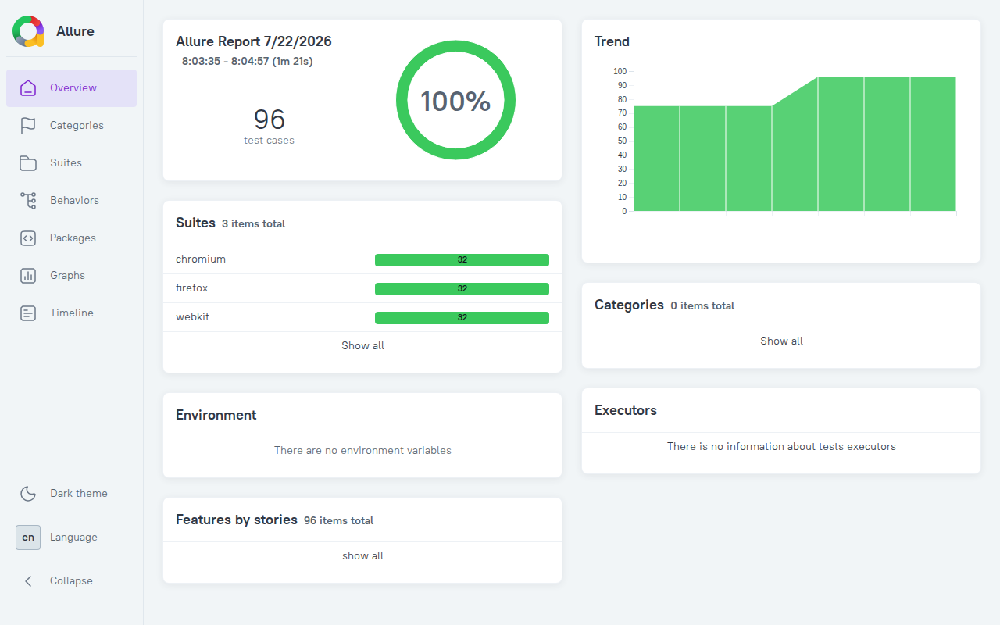
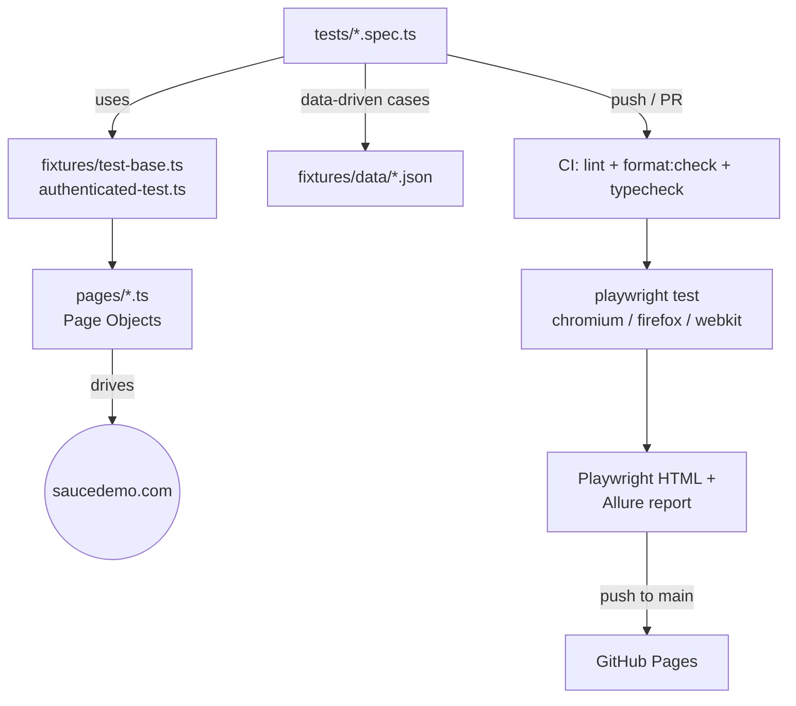

# Functional QA — SauceDemo

[](https://github.com/gesttaltt/qa-funtional-testing/actions/workflows/playwright.yml)
[](https://github.com/gesttaltt/qa-funtional-testing/actions/workflows/codeql.yml)
[](https://playwright.dev)
[](LICENSE)

End-to-end functional test suite for [saucedemo.com](https://www.saucedemo.com), built with [Playwright](https://playwright.dev/) + TypeScript following the Page Object Model pattern.

**Live report:** https://gesttaltt.github.io/qa-funtional-testing/

[](https://gesttaltt.github.io/qa-funtional-testing/)

## Coverage

- **Login**: valid credentials plus a data-driven battery of invalid cases (empty fields, wrong password, locked-out user).
- **Inventory**: sorting by name and price, adding/removing products, cart badge.
- **Cart**: cart contents, removing items, continue shopping.
- **Checkout**: full purchase flow with cross-screen price integrity (inventory → cart → checkout summary must show the same price) and cart-clears-on-completion check; required-field validation (data-driven) plus a documented quirk where whitespace-only fields bypass validation; total price calculation, verified per-item against inventory, across different cart sizes (data-driven).
- **Menu**: logout and reset app state.
- **Special users**: known bugs for `problem_user` (broken image) and `error_user` (uncaught JS exception), tolerance for `performance_glitch_user`'s delay.
- **Accessibility**: [axe-core](https://github.com/dequelabs/axe-core) scan on every screen (login through checkout-complete), failing only on new violations; a documented known issue for the inventory sort `<select>` missing an accessible name.

## Structure

```
pages/          Page Objects (locators + actions per screen)
fixtures/       Playwright custom fixtures and user data
fixtures/data/  External JSON test data (data-driven testing)
tests/          Specs organized by business flow
```

## Architecture



Specs never talk to the page directly: they call Page Object methods, which own the locators. `fixtures/test-base.ts` wires the Page Objects into Playwright's `test`; `fixtures/authenticated-test.ts` extends it to auto-login as `standard_user` for specs that don't need to control credentials, cutting login boilerplate from every test in `inventory`, `cart`, `checkout`, `menu`, and most of `accessibility`. Every push runs quality gates before the browsers even install — a lint, format, or type error fails fast instead of burning CI minutes on a doomed test run.

## Data-driven testing

Repetitive cases (invalid login variants, checkout validation, cart combinations) live as JSON under `fixtures/data/` and are looped over inside each spec with a `for` to generate one independent test per case — so adding a new case just means editing the JSON, not touching test code.

Data-driven cases are only added when they exercise genuinely different app behavior. An earlier version of this suite parametrized the full purchase flow across several "customer profiles" (different names, postal code formats) — dropped after verifying that SauceDemo's checkout never reflects that input anywhere in the UI, so the variants were tripling test count without adding coverage. The remaining checkout e2e test is a single, deeper case instead.

## Usage

```bash
npm install
npx playwright install        # download the browsers

npm test                      # run the full suite (chromium, firefox, webkit)
npm run test:ui                # interactive UI mode
npm run test:headed            # run with a visible browser
npm run report                 # open the latest Playwright HTML report
npm run test:flaky-check       # run every test 5x with retries off, to catch intermittent failures
```

## Reliability

Since this suite runs against a live third-party site rather than an environment we control, it's been stress-tested for flakiness with `test:flaky-check`: 300 individual test executions across Chromium and Firefox (repeat-each 3-6x, retries disabled) with zero intermittent failures, on top of a clean CI history. Assertions favor Playwright's auto-retrying `expect(locator)` matchers; the few places that read a value with `.textContent()` instead rely on Playwright's built-in wait-for-attachment behavior rather than a fixed timeout.

## Accessibility

`tests/accessibility.spec.ts` runs an [axe-core](https://github.com/dequelabs/axe-core) scan (via `@axe-core/playwright`) on every screen. SauceDemo has real, pre-existing violations we don't control (missing `<main>` landmark, no `<h1>`, content outside landmarks, and a critical one: the inventory sort dropdown has no accessible name) — these are excluded from the per-page checks (`KNOWN_RULES` in the spec) so the suite is red only for _new_ violations, not this baseline debt. The dropdown issue is still tracked, just as its own dedicated "known bug" test rather than failing the general scan — same pattern as the `problem_user`/`error_user` tests.

## Allure reports

Every run also writes raw results to `allure-results/` via the `allure-playwright` reporter. Requires a Java runtime (used by the Allure CLI).

```bash
npm run allure:serve      # generate + open a report in one step (temp dir)
npm run allure:generate   # build a static report into allure-report/
npm run allure:open       # open the last generated allure-report/
```

## CI

Every push/PR to `main` runs the full suite on GitHub Actions (`.github/workflows/playwright.yml`) and publishes both the Playwright HTML report and the generated Allure report as artifacts. On pushes to `main`, a second job regenerates the Allure report — carrying over trend history from the previously deployed site — and publishes it to GitHub Pages at https://gesttaltt.github.io/qa-funtional-testing/.
